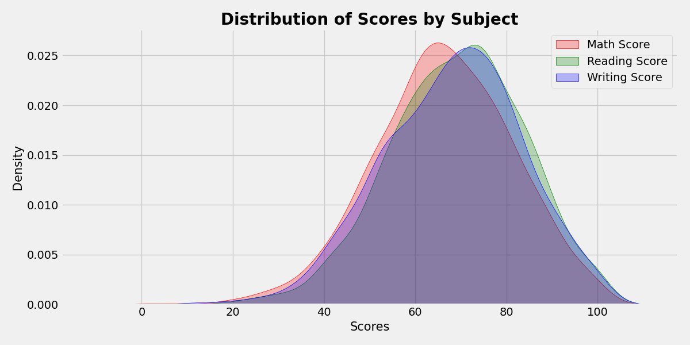
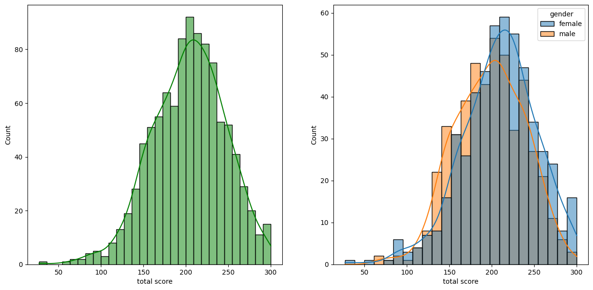
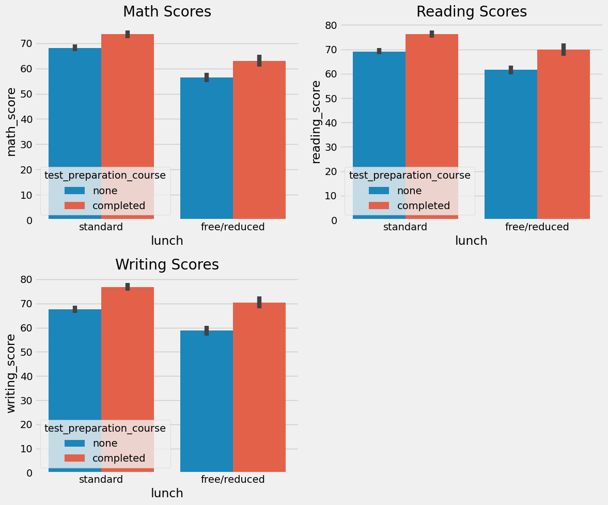
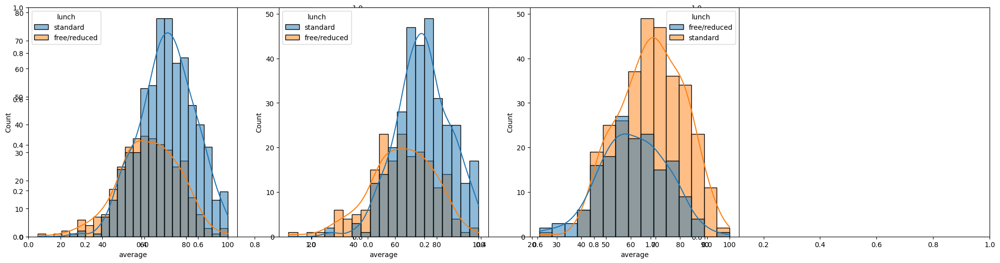
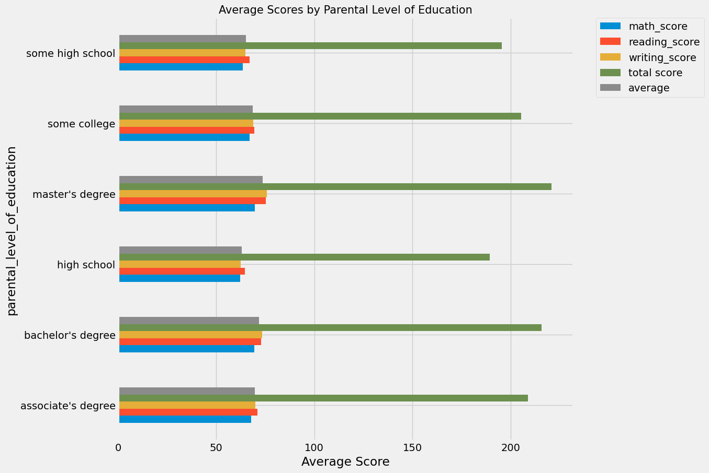
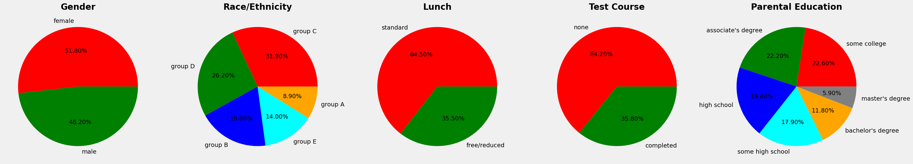

# Student Performance Indicator

## Project Overview
The **Student Performance Indicator** is an end-to-end Machine Learning project aimed at understanding how various factors (such as gender, ethnicity, parental level of education, lunch plans, and test preparation courses) influence a student's test scores in Mathematics, Reading, and Writing.

## Project Structure
```text
Student-Performance-Indicator/
│
├── artifacts/             # Stored model artifacts, preprocessors, and datasets
├── logs/                  # Training and execution logs for debugging
├── notebook/              # Jupyter notebooks for data exploration and trials
│   ├── EDA STUDENT PERFORMANCE.ipynb  # Exploratory Data Analysis & Visualizations
│   └── MODEL TRAINING.ipynb           # Model selection and evaluation
│
├── src/                   # Source code for the ML pipeline
│   ├── components/        # Individual pipeline steps (data ingestion, transformation, model trainer)
│   ├── pipeline/          # Orchestration of train and predict pipelines
│   ├── exception.py       # Custom exception handling module
│   ├── logger.py          # Custom logging module for tracking execution
│   └── utils.py           # Helper functions for saving/loading models & evaluation
│
├── templates/             # HTML templates for the Flask web application
├── app.py                 # Flask web application entry point
├── requirements.txt       # Python dependencies required for the project
├── setup.py               # Setup configuration for building the project as a package
└── README.md              # Project documentation
```

## Setup & Installation

### 1. Clone the Repository
```bash
git clone <repository_url>
cd Student-Performance-Indicator
```

### 2. Create a Virtual Environment
It is recommended to use a virtual environment to manage dependencies.
```bash
python -m venv .venv
# Activate on Windows:
.venv\Scripts\activate
# Activate on macOS/Linux:
source .venv/bin/activate
```

### 3. Install Dependencies
Install all required packages using `requirements.txt`:
```bash
pip install -r requirements.txt
```

### 4. Run the Web Application
Start the Flask server to interact with the predictive model:
```bash
python app.py
```
*The application will typically be available at `http://127.0.0.1:5000/`*

---

## Exploratory Data Analysis (EDA) Insights

The exploratory data analysis (`EDA STUDENT PERFORMANCE.ipynb`) revealed several key insights regarding student performance:

1. **Overall Performance:**
   - Students generally performed worst in **Maths**.
   - The best overall performance was observed in the **Reading** section.

   *(Take the average score histogram & KDE plot from Cell 17/18)*
   

2. **Gender Differences:**
   - **Female students** tend to perform better in Reading and Writing.
   - **Male students** tend to have a slight edge in Maths but lag behind in overall average compared to females.
   
   *(Take the Total Average vs Math Average bar chart grouped by gender from Cell 39/40)*
   

3. **Impact of Test Preparation Course:**
   - Students who completed a test preparation course consistently scored higher across *all three subjects* than those who did not.

   *(Take the Students vs Test Preparation Course count plots from Cell 61/62)*
   

4. **Socioeconomic Impact (Lunch type):**
   - Students with **Standard lunch** performed significantly better than those with a Free/Reduced lunch, indicating a strong correlation between socioeconomic status and academic outcomes.

   *(Take the Scores vs Lunch & Test Prep barplots from Cell 61/62)*
   

5. **Parental Level of Education:**
   - There is a positive trend between higher parental education levels (e.g., Master's or Bachelor's degrees) and higher student test scores.

   *(Take the Average Scores by Parental Level of Education horizontal bar chart from Cell 55/56)*
   

### Feature Distributions at a Glance
*(Take the large 5-subplot Pie Chart figure from Cell 33/34 showing Gender, Race, Lunch, Test Course, and Parental Education)*


## Technologies Used
- **Language:** Python
- **Data Manipulation & Analysis:** Pandas, NumPy
- **Data Visualization:** Matplotlib, Seaborn
- **Machine Learning:** Scikit-Learn, CatBoost, XGBoost
- **Web Framework:** Flask

---

## Machine Learning Pipeline Architecture

The project's source code (`src/`) is built using a modular, object-oriented pipeline designed for scalability. 

### 1. Components (`src/components/`)
- **`data_ingestion.py`**: Reads the raw CSV data, performs a Train/Test split (80/20), and saves the resulting datasets into the `artifacts/` folder.
- **`data_transformation.py`**: Handles feature engineering. It creates a `ColumnTransformer` with `Pipeline`s that:
   - Impute missing values (median for numerical, most frequent for categorical).
   - Apply `StandardScaler` to numerical columns.
   - Apply `OneHotEncoder` followed by `StandardScaler` to categorical columns.
   - Saves the preprocessor object (`preprocessor.pkl`) for inference.
- **`model_trainer.py`**: Tests multiple regression algorithms (Random Forest, Decision Tree, Gradient Boosting, Linear Regression, XGBoost, CatBoost, AdaBoost) alongside hyperparameter tuning dictionaries. Evaluates them based on R² score and saves the best performing model (`model.pkl`).

### 2. Pipelines (`src/pipeline/`)
- **`train_pipeline.py`**: Orchestrates the entire training flow by sequentially running Data Ingestion, Data Transformation, and Model Training, outputting the final R² score.
- **`predict_pipeline.py`**: A dedicated inference pipeline. It takes user input from the web interface (via `CustomData` class), loads the saved `preprocessor.pkl` and `model.pkl`, scales the incoming data, and returns the predicted math score.
